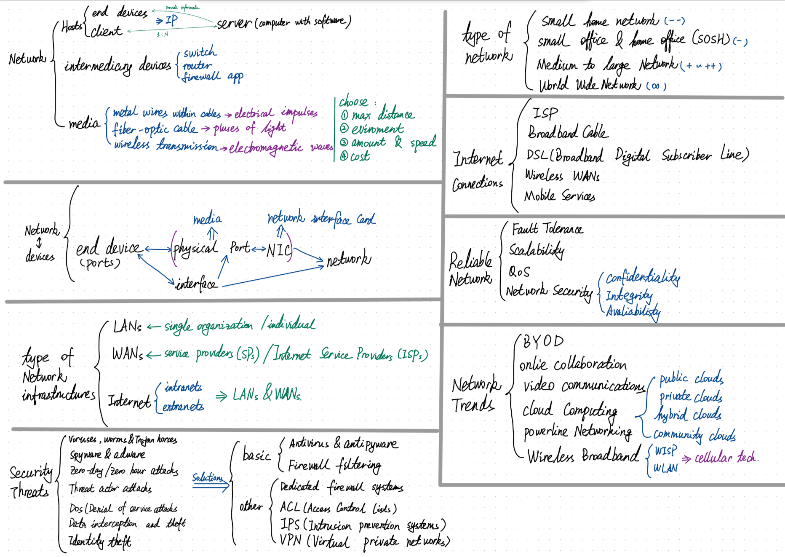
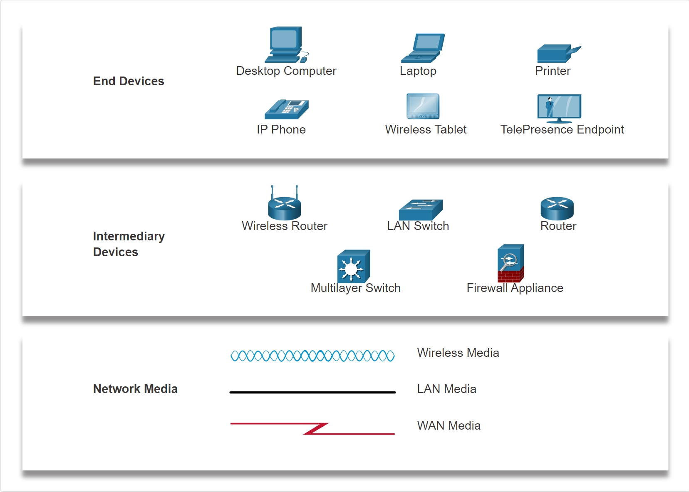

# Introduction to Networks

## **Hosts** (End Device) (Clients)

* All computers that are <u>connected to a network</u> and <u>participate directly in network communication</u>.

### **Hosts**
   > Host is specially refer to <u>devices assigned a number (IP)</u> for communication purposes on the network.

   **End Device**
   > * End Device either the <u>source</u> or <u>destination</u> of a message transmitted over the network.
   > * <u>Each</u> end device on a network has <u>an address</u>.

   **Clients** 
   >* Clients have software for <u>requesting and displaying the information</u> obtained from the server.

### **IP** (Internet Protocol)

>* IP address <u>identifies the host and the network</u> (which the host is attached).

## **Intermediary Devices**

* **Router , Wireless Router**
* **Switch , Multilayer Switch**
* **Firewall Appliance**

>* Connect the <u>individual end devices</u> to the network. 
>* Connect multiple <u>individual networks</u> to form an internetwork. 
>* <u>Provide connectivity</u> and <u>ensure</u> that data flows across the network.
>* <u>Determine the path</u> that messages should take through the network 
( use the destination end device address, in conjunction with information about the network interconnections ) .

### Intermediary network devices perform some or all of these functions:
>* Regenerate and retransmit communication signals
>* <u>Maintain information</u> about what pathwavs exist through the network and internetwork
>* <u>Notify</u> other devices of <u>errors and communication failures</u>
>* <u>Direct data along alternate pathwavs</u> when there is a link failure
>* Classify and direct messages according to priorities
>* Permit or deny the flow of data, based on <u>security settings</u>

* An Ethernet hub = multiport repeater. Repeatersegenerate and retransmit communication sinals -> take signals and send them again to keep the communication going.
* <u>All intermediary devices perform the function of arepeater</u>.

## **Servers**

> * The computers with software that allow them to <u>provide information to other end devices</u> network.
> * Each service requires <u>separate server software</u>.
> * A computer with server software can provide services <u>simultaneously</u> to <u>many different clients</u>.

## **Network Media** ##

### Modern networks primarily use **three types of media** to interconnect devices:

>* **Metal wires within cables** 

   Data is encoded into <u>electrical impulses</u>.
>* **fiber-optic cable** ( Glass or plastic fibers within cables ) 

   Data is encoded into <u>pulses of light</u>.
>* **Wireless transmission** 

   Data is <u>encoded</u> via modulation of <u>specific frequencies</u> of <u>electromagnetic waves</u>.

### 4 **main criteria** for choosing network media :

>* **the maximum distance** that the media can successfully carry a signal
>* **the environment** in which the media will be installed
>* **the amount of data** and at **speed** must it be transmitted
>* **the cost** of the media and installation

## **Peer-to-Peer** ##

For the **Peer-to-Peer network**, the computers to be used for <u>Servers</u> and <u>Clients</u> on the network <u>at the same time</u>.

**Advantages**:
>* Easy to set up.
>* Less complex.
>* Lower cost 
    ( because network devices and dedicated servers may not be required).
>* Can be used for simple tasks 
    ( such as transferring files and sharing printers).

**Disadvantages**:
>* No centralized administration.
>* Not as secure.
>* Not scalable.
>* Slow performance 
   (because all devices may act as both clients and servers).

## **Network**

>* **Network Interface Card (NIC)** 
   
   A NIC <u>physically connects</u> the <u>end device</u> to the network .
>* **Physical Port** 
   
   A connector or outlet on a networking device where the <u>media connects</u> to an end device or another networking device.
>* **Interface** 
   
   <u>Specialized ports</u> on a networking device that <u>connect to individual networks</u>. 
   
   Because routers connect networks, the **ports on a router** are referred to as <u>network interfaces</u>.
>* The terms port and interface are often used interchangeably.

### **Topology Diagram**
>* **Physical Topology Diagrams**
   
   Illustrate the <u>physical location</u> of <u>intermediary devices</u> and <u>cable installation</u>.
>* **Logical Topology Diagrams**

   Illustrate <u>devices</u>, <u>ports</u>, and the <u>addressing scheme</u> of the network.

### **Types of Networks**

* **Small home networks** 
   
   Connect a few computers to each other and to the internet.

* **Small office and home office (SOHO)** 
    
   Allows computers in a home office or a remote office to connect to a corporate network, or access centralized, shared resources.

* **Medium to large Networks** 
   
   Can have many locations with hundreds or thousands of interconnected hosts.

* **World Wide Networks** 
   
   Connects hundreds of millions of computers world-wide.

## **Types of Network Infrastructures**

### **LANs**

**Local Area Networks** is a network infrastructure that provides access to <u>users</u> and <u>end devices</u> in <u>a small geographical area</u>.

>* LANs <u>interconnect end devices</u> in a <u>limited area</u>.
>* A LAN is usually <u>administered by a single organization or individual</u>. Administrative control is enforced at the network level and governs the security and access control policies.
>* LANs <u>provide high-speed bandwidth</u> to internal <u>end devices</u> and <u>intermediary devices</u>.

### **WANs**

**Wide Area Networks** is a network infrastructure that spans <u>a wide geographical area</u>. WANs are typically managed by **service providers (SPs)** or **Internet Service Providers (ISPs)**.

>* WANs <u>interconnect LANs</u> over wide geographical areas.
>* WANs are usually <u>administered by multiple service providers</u>.
>* WANs typically <u>provide slower speed links between LANs</u>.

### **Internet**

Can view the internet as a collection of interconnected LANs and WANs.

* The internet is <u>not owned by any individual or group</u>.

#### **Intranets**

* A term often used to refer to a <u>private connection</u> of LANs and WANs that belongs to an organization. 

* An intranet is designed to <u>be accessible only</u> by the organization's members, employees, or others with authorization.
    
#### **Extranets**
>* To <u>provide secure and safe access to individuals</u> who work for a different organization but <u>require access to the organization's data</u>.

## **Internet Connections**
* ISP ( Internet Service Provider )
* Broadband Cable
* Broadband Digital Subscriber Line (DSL)
* Wireless WANs
* Mobile Services

## **Reliable Networks**

**The term network architecture** refers to the technologies that support the infrastructure and the programmed services and rules, or protocols, that move data across the network.

### **Fault Tolerance**

>* A fault tolerant network is one that <u>limits</u> the number of affected devices during a <u>failure</u>.
>* These networks depend on <u>multiple paths</u> between the source and destination of a message. If one path fails, the messages are instantly sent over a different link. 
>* Having multiple paths to a destination is known as **redundancy** → for example: Implementing a packet-switched network.

### **Scalability**

>* A scalable network expands quickly to support new users and applications.
>* It does this without degrading the performance of services that are being accessed by existing users.

### **Quality of Service (QoS)**

>* Congestion occurs when the demand for bandwidth exceeds the amount available. Network bandwidth is measured in the number of bits that can be transmitted in a single second, or **bits per second (bps)**. 
>* When the volume of traffic is greater than what can be transported across the network, devices will <u>hold the packets in memory</u> until resources become available to transmit them. 
>* **QoS** is managed by the <u>router</u>, <u>ensures that prioties</u> are matched with the type of communication and its importance to the organization.

### **Network Security**
   
   In order to achieve the goals of network security, there are three **primary requirements**.

>* **Confidentiality** 

Data confidentiality means that only the intended and authorized recipients can access and read data.
>* **Integrity** 

Data integrity assures users that the information has not been altered in transmission, from origin to destination.
>* **Availability**

Data availability assures users of timely and reliable access to data services for authorized users.

## **Network Trends**

### **Bring Your Own Device (BYOD)**

>* BYOD means any device, with any ownership, used anywhere.

### **Online Collaboration**

>* Collaboration tools give a way to instantly connect, interact, and achieve their objectives.

### **Video Communications**

### **Cloud Computing**

**Public clouds**

>* Cloud-based applications and services offered in a public cloud are made available to the general population. 
>* The public cloud uses the internet to provide services.
   
**Private clouds**

>* Cloud-based applications and services offered in a private cloud are intended for a specific organization or entity. 
>* It can be set up using the organization’s private network, though this can be expensive to build and maintain. 
>* A private cloud can also be managed by an outside organization with strict access security.

**Hybrid clouds**

>* A hybrid cloud is made up of two or more clouds, where each part remains a distinct object, but both are connected using a single architecture.   
>* Individuals on a hybrid cloud would be able to have degrees of access to various services based on user access rights.

**Community clouds**

>* A community cloud is created for exclusive use by specific entities or organizations【the functional needs that have been customized for the community】.  
>* Community clouds are similar to a public cloud environment, but with set levels of security, privacy, and even regulatory compliance of a private cloud.

### **Powerline Networking**

>* Using the same wiring that delivers electricity, powerline networking sends information by sending data <u>on certain frequencies</u>.
>* Powerline networking is not a substitute for dedicated cabling in data networks.
>* It is an alternative when data network cables or wireless communications are not possible or effective.

### **Wireless Broadband**

   **This solution uses the same <u>cellular technology</u> as a smart phone.** 

>* A Wireless Internet Service Provider (WISP) 
>* wireless local area networks (WLANs)

## **Network Security**
### **Security Threats**

>* **Viruses, worms, and Trojan horses**
   
   These contain <u>malicious software or code</u> running on a user device.
>* **Spyware and adware**

   These are types of <u>software</u> which are installed on a user's device.
>* **Zero-day attacks** 

   Also called zero-hour attacks, these occur on the <u>first day</u> that a vulnerability becomes known.
>* **Threat actor attacks**

   A malicious person attacks user devices or network resources.
>* **Denial of service attacks (DoS)**

   These attacks <u>slow or crash applications and processes</u> on a network device.
>* **Data interception and theft**

   This attack <u>captures private information</u> from an organization's network.
>* **Identity theft**

   This attack <u>steals the login credentials</u> of a user in order to access private data.

### **Security Solutions**
   The basic security components for a home or small office network:

>* **Antivirus and antispyware**

   These applications help to protect end devices from becoming infected with malicious software.
>* **Firewall filtering**

   Firewall filtering <u>blocks unauthorized access</u> into and out of the network. 

Larger networks and corporate networks use antivirus, antispyware, and firewall filtering, but they also have other security requirements:
>* **Dedicated firewall systems**

   Provide more advanced firewall capabilities that can filter large amounts of traffic with more granularity.
>* **Access control lists (ACL)**

   These further filter access and traffic forwarding based on IP addresses and applications.
>* **Intrusion prevention systems (IPS)**

   These <u>identify fast-spreading threats</u>, such as zero-day or zero-hour attacks.
>* **Virtual private networks (VPN)**

   These provide secure access into an organization for remote workers.

