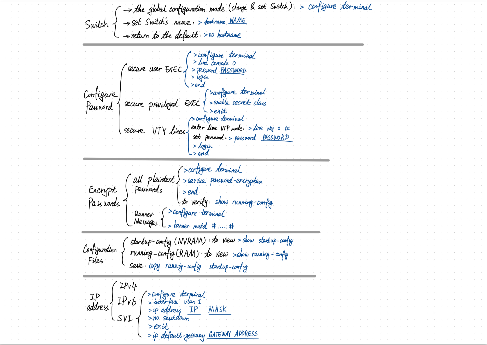

# Basic Switch and End Device Configuration

## **Configure Device**

The privileged EXEC mode -> the global configuration mode:

```
//The privileged EXEC mode -> the global configuration mode:
Switch# configure terminal 

Switch(config)# hostname Sw-Floor-1

Sw-Floor-1(config)#

//To return the switch to the default prompt
Sw-Floor-1(config)# no hostname
```

## **Configure Password**

* **To secure user EXEC mode access**:
```
//When initially connect to a device -> user EXEC mode.
Sw-Floor-1# configure terminal

//enter line console configuration mode
//0 is used to represent the first (and in most cases the only) console interface
Sw-Floor-1(config)# line console 0

//specify the user EXEC mode password
Sw-Floor-1(config-line)# password cisco

//enable user EXEC access
Sw-Floor-1(config-line)# login

Sw-Floor-1(config-line)# end
Sw-Floor-1#
```

* **To secure privileged EXEC access**:
```
Sw-Floor-1# configure terminal
Sw-Floor-1(config)# enable secret class
Sw-Floor-1(config)# exit
Sw-Floor-1#
```

* **To secure VTY lines**

Virtual terminal (VTY) lines enable remote access using Telnet or SSH to the device. 

```
Sw-Floor-1# configure terminal

//enter line VTY mode
Sw-Floor-1(config)# line vty 0 15

//specify the VTY
Sw-Floor-1(config-line)# password cisco 

//enable VTY access
Sw-Floor-1(config-line)# login 
Sw-Floor-1(config-line)# end
Sw-Floor-1#
```

## **Encrypt Passwords**

* **To encrypt all plaintext passwords**

```
Sw-Floor-1# configure terminal

//The command applies weak encryption to all unencrypted passwords.
Sw-Floor-1(config)# service password-encryption
Sw-Floor-1(config)#

Sw-Floor-1(config)# end

// to verify that passwords are now encrypted
Sw-Floor-1# show running-config
```

* **Banner Messages**
To create a banner message of the day on a network device for the legal process:

```
Sw-Floor-1# configure terminal
Sw-Floor-1(config)# banner motd #Authorized Access Only#
```

## **Configuration Files**

**two system files that store the device configuration**:

- **startup-config** 
    - This is the saved configuration file that is stored in NVRAM. 

    - It contains all the commands that will be used by the device upon startup or reboot. 
    
    - Flash does **not lose** its contents when the device is powered off.

    - **To view the startup configuration file**:
    ```
    Sw-Floor-1# show startup-config
    ```

- **running-config**
     - This is stored in Random Access Memory (RAM). RAM is volatile memory.
     
     - It reflects the current configuration. 
     
     - Modifying a running configuration affects the operation of a Cisco device immediately.  
     
     - It loses all of its content when the device is powered off or restarted.

    - **to view the running config**:
    ```
    Sw-Floor-1# show running-config
    ```

**To save changes made to the running configuration to the startup configuration file**:

```
Sw-Floor-1# copy running-config startup-config
```

## **IP Addresses**

**IPv4**

* The structure of an IPv4 address is called dotted decimal notation.

* represented by four decimal numbers between 0 and 255.

* IPv4 addresses are assigned to individual devices connected to a network.

* Coupled with the IPv4 address, the subnet mask determines to which subnet the device is a member.

* IPv4 address information can be entered into end devices manually, or automatically using Dynamic Host Configuration Protocol (DHCP).

For example:

    IPv4 address (192.168.1.10)

    subnet mask (255.255.255.0)

    default gateway (192.168.1.1) 


**IPv6**
* Every four bits is represented by a single hexadecimal digit; a total of 32 hexadecimal values. 

* 128 bits in length

* IPv6 addresses are not case-sensitive

**SVI（Switch Virtual Interface）**

* To access the switch remotely, an IP address and a subnet mask must be configured on the SVI. 
    
* To configure an SVI on a switch:
    
```
//use the command in global configuration mode
Sw-Floor-1# configure terminal
Sw-Floor-1(config)# interface vlan 1

//Assign an IP address and subnet mask to the SVI
Sw-Floor-1(config-if)# ip address 192.168.1.20 255.255.255.

//activate or enable an interface
Sw-Floor-1(config-if)# no shutdown 

Sw-Floor-1(config-if)# exit

//Configure the default gateway of the switch
//Specify the next-hop gateway address for the switch to send packets
Sw-Floor-1(config)# ip default-gateway 192.168.1.1
```

