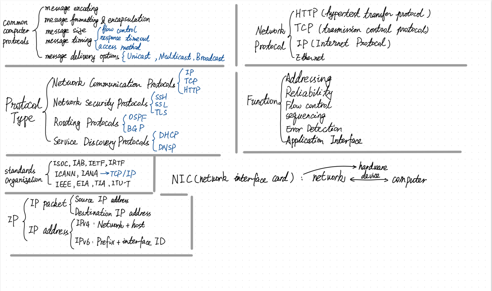
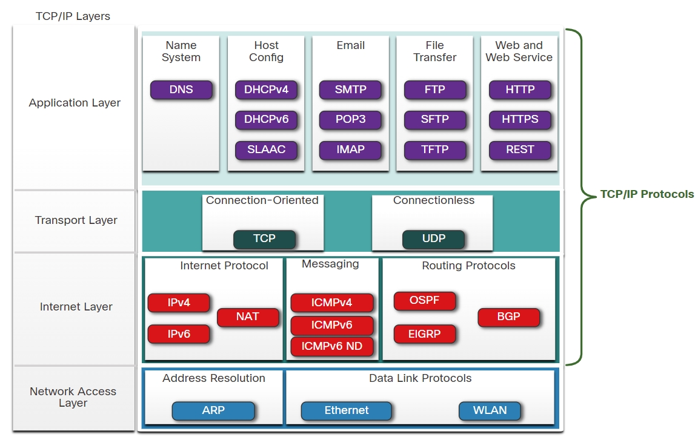
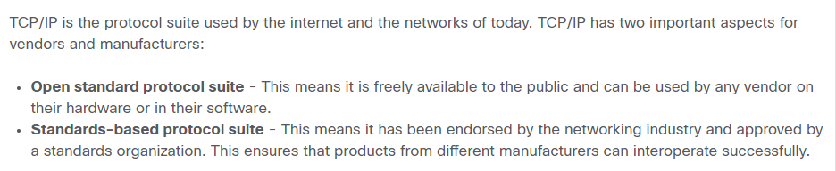
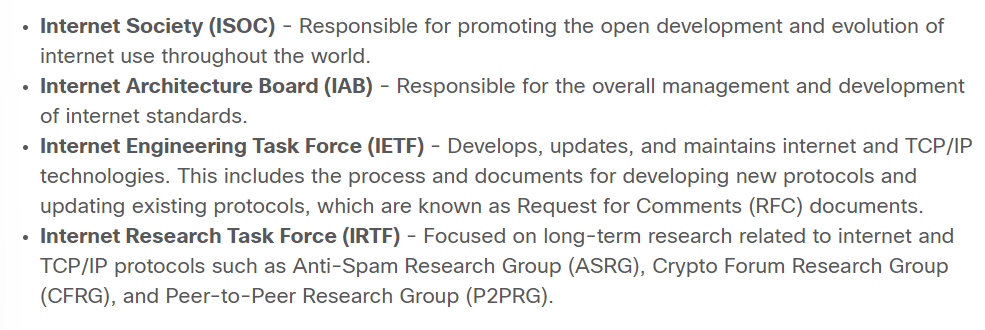
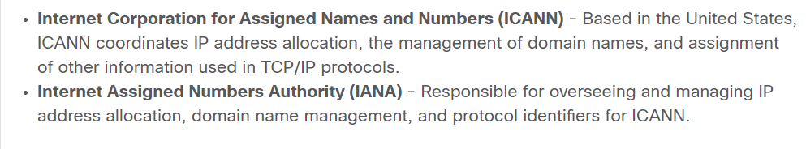
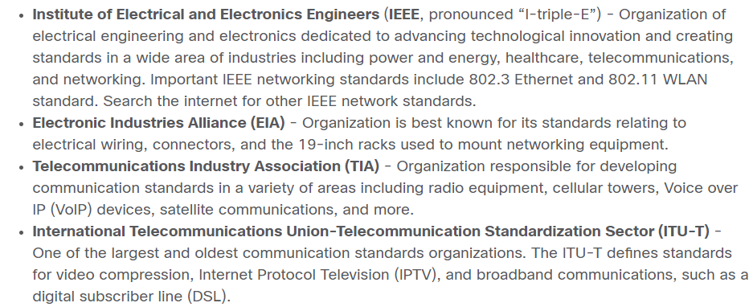
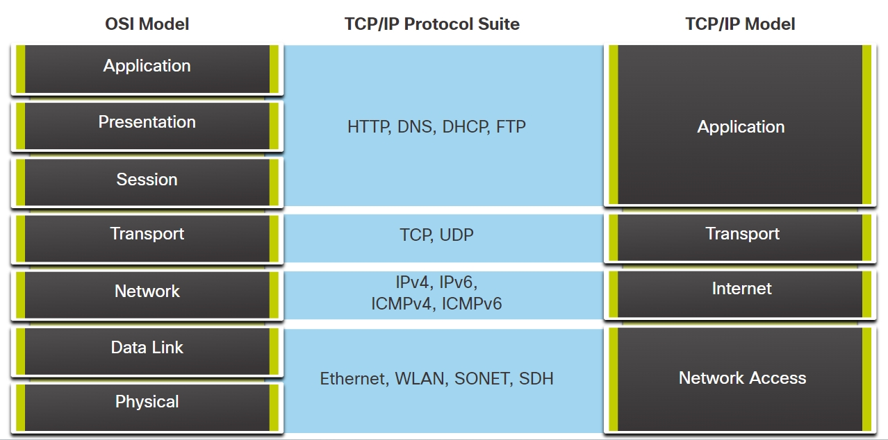
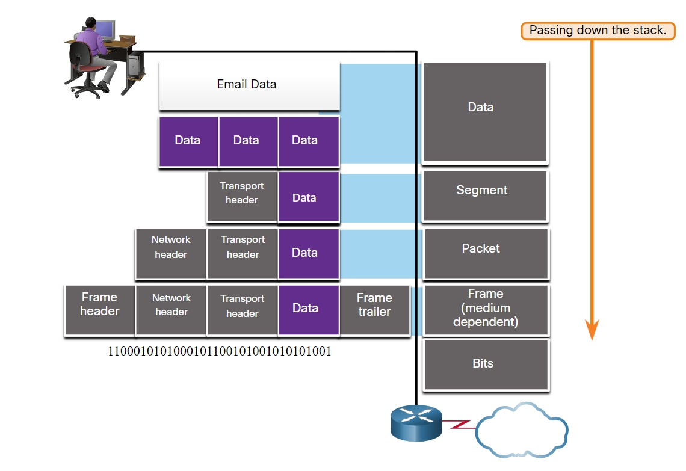
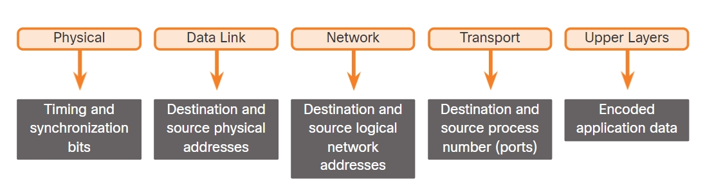

# Protocols and Models

## The Rules ##

**Three elements in common**: 
- **Message source (sender)** 

    Message sources are people, or electronic devices, that need to send a message to other individuals or devices.

- **Message Destination (receiver)**

    The destination **receives** the message and **interprets** it.

- **Channel** 

    This consists of the **media** that provides the pathway over which the message travels from source to destination.

## Communication Protocols

### Protocols must account for:
    
- An identified sender and receiver
- Common language and grammar
- Speed and timing of delivery
- Confirmation or acknowledgment requirements

### Common computer protocols include:

- Message encoding
- Message formatting and encapsulation
- Message size
- Message timing
- Message delivery options

**Message Encoding**

>- Encoding is the process of converting information into another acceptable form, for transmission. 
>- Decoding reverses this process to interpret the information.
>- Encoding between hosts must be in <u>an appropriate format for the medium</u>.

**Message Formatting and Encapsulation**

>- Part of the <u>formatting process</u> is properly identifying the source of the message and its destination.
>- Message formats depend on the <u>type</u> of message and the channel that is used to deliver the message.

**Message Size**

>- It is necessary to break the message into <u>smaller pieces</u> when a long message is sent from one host to another over a network.
>- Frames that are too long or too short are not delivered.
>- The <u>long message</u> will be sent in separate frames. 
    Each frame containing:
>1. a piece of the original message
>2. its own addressing information

At the receiving host, the individual pieces of the message are reconstructed into the original message.

**Message Timing**

Message timing includes：

* **Flow Control** 

    This is the process of managing the rate of data transmission. 

    >- Flow control defines how much information can be sent and the speed at which it can be delivered. 
    >- In network communication, there are network protocols used by the source and destination devices to negotiate and manage the flow of information.

* **Response Timeout**
    
    Hosts use network protocols that：

    >- specify how long to wait for responses 
    >- what action to take if a response timeout occurs.

* **Access method**

    This determines when someone can send a message.

    >- when a device wants to transmit on a wireless LAN, it is necessary for the WLAN network interface card (NIC) to determine whether the wireless medium is available.

**Message Delivery Options**

Three types of data communications include:

>- **Unicast**
    
Information is being transmitted to a **single** end device.
>- **Multicast**

Information is being transmitted to a **one or more** end devices.
>- **Broadcast**

Information is being transmitted to **all** end devices.

## Network Protocol ##

**Hypertext Transfer Protocol(HTTP)**  
    
>* This protoco coverns the wav a web server and a web client interact. 

>* HTTP deinesthe content and formatting of the requests and responses that are exchanged between the client and server. 
    
>* Both theclient and the web server software implement HTTP as part of the application. 
    
>* HTTP relies on other protocols to governhow the messages are transported between the client and server.
    
**Transmission Control Protocol (TCP)** 

>* This protocol manages the individual conversations. 
    
>* TCP is responsible forguaranteeing the reliable delivery of the information and managing flow control between the end devices.
    
**Internet Protocol (IP)** 
    
>* This protocol is responsible for delivering messages from the sender to the receiver.
    
>* IP is used byrouters to forward the messages across multiple networks.
    
**Ethernet** 

>* This protocol is responsible for the delivery of messages from one NiC to another NiC on the same Ethernetlocal area network (LAN).

### **Protocol Type** ###
>* Types of protocols that are needed to enable communications across one or more networks:

* **Network Communications Protocols**

    Protocols enable **two or more** devices to communicate over **one or more** networks.

    For example:

    * IP
    * TCP
    * HTTP

* **Network Security Protocols**

    Protocols secure data to provide **authentication**, **data integrity**, and **data encryption**.

    For example:

    * Secure protocols include Secure Shell (SSH)
    * Secure Sockets Layer (SSL)
    * Transport Layer Security (TLS)

* **Routing Protocols**

    Enable routers to **exchange** route information, **compare path** information, and then to **select the best path** to the destination network.

    For example:

    * **OSPF** (Open Shortest Path First ) 
    * **BGP** (Border Gateway Protocol)

* **Service Discovery Protocols**

    Used for the automatic detection of devices or services. 

    For example:

    * **DHCP** (Dynamic Host Configuration Protocol)  -> discovers services for IP address allocation
    * **DNS** (Domain Name System) -> perform name-to-IP address translation.

### **Function and Description**

* **Addressing**

    **Identifies** the sender and the intended receiver of the message using a defined addressing scheme. 

    For example:

    * Ethernet
    * IPv4
    * IPv6

* **Reliability**

     Provides **guaranteed delivery mechanisms** in case messages are lost or corrupted in transit. 

    * TCP provides guaranteed delivery.

* **Flow control**

    Ensures that data flows at an **efficient rate** between two communicating devices.

    * TCP provides flow control services.

* **Sequencing**

    **Uniquely labels** each transmitted segment of data.

    The receiving device uses the sequencing information to reassemble the information correctly.

    * TCP provides sequencing services.

* **Error Detection**

    Used to determine if data became **corrupted** during transmission. 

    For example: 

     * Ethernet
     * IPv4
     * IPv6
     * TCP

* **Application Interface**

    Contains information used for **process-to-process** communications between network applications.

## Protocol Suites

A protocol suite is a group of inter-related protocols necessary to perform a communication function. 

Protocol suites are designed to work with each other seamlessly.

* **TCP/IP Protocol Example**
available for :
    * application layers

    * transport layers 

    * internet layers

(no in the network access layer). The most common network access layer LAN protocols are Ethernet and WLAN (wireless LAN) protocols. Network access layer protocols are responsible for delivering the IP packet over the physical medium.

TCP/IP is the protocol suite used by the internet and the networks of today. TCP/P has two important aspects forvendors and manufacturers:
    
- **Open standard protocol suite**

    * freely available to the public 

- **Standards-based protocol suite** 

    * it has been endorsed by the networkina industrv and approved bya standards organization -> ensures that products from different manufacturers can interoperate successfully.

## Standards Organizations

Standards organizations are usually vendor-neutral, non-profit organizations established to develop and promote the concept of open standards. 

Various organizations have different responsibilities for promoting and creating standards for the internet including: ISOC, IAB, IETF, and IRTF. 

Standards organizations that develop and support TCP/IP include: ICANN and IANA. 

Electronic and communications standards organizations include: IEEE, EIA, TIA, and ITU-T.

## Reference Models

Benefits of using a layered model to describe network protocols and operations:

 - Assisting in protocol design because protocols that operate at a specific layer have defined information that they act upon and a defined interface to the layers above and below
 - Fostering competition 
 - Preventing technology or capability changes in one layer from affecting other layers above and below
 - Providing a common language to describe networking functions and capabilities

## Data Encapsulation
This leads to segmenting messages having two primary benefits:

* **Increases speed** 

Because a large data stream is segmented into packets, large amounts of data can be sent over the network without tying up a communications link. This allows many different conversations to be interleaved on the network called multiplexing.

* **Increases efficiency** 

If a single segment is fails to reach its destination due to a failure in the network or network congestion, only that segment needs to be retransmitted instead of resending the entire data stream.

## Protocol Data Units （PUD）

* **Data** - The general term for the PDU used at the application layer
* **Segment** - Transport layer PDU
* **Packet** - Network layer PDU
* **Frame** - Data Link layer PDU
* **Bits** - Physical layer PDU used when physically transmitting data over the medium

**Note**: lf the Transport header is TCP, then it is a segment. lf the Transport header is UDP then it is a datagram.

* **Multiplexing**

    * By sending smaller individual pieces from source to destination, many different conversations can be interleaved on the network.

    * Segmentation can increase the efficiency of network communications. If part of the message fails to make it to the destination only the missing parts need to be retransmitted.

## Data Access

The network and data link layers are responsible for delivering the data from the source device to the destination device. 

* **Network layer** source and destination addresses 

    Responsible for delivering the IP packet from the original source to the final destination, which may be on the same network or a remote network.

* **Data link layer** source and destination addresses 
    Responsible for delivering the data link frame from one network interface card (NIC) to another NIC on the same network.

## Layer 3 Logical Address (IP address)

To deliver the IP packet from the original source to the final destination.

The IP packet contains two IP addresses:

* **Source IP address** 

    The IP address of the sending device, which is the original source of the packet.

* **Destination IP address** 

    The IP address of the receiving device, which is the final destination of the packet.

An IP address contains two parts:

* **Network portion (IPv4) or Prefix (IPv6)** 

    <u>The left-most part</u> of the address that indicates the network in which the IP address is a member. All devices on the same network will have the same network portion of the address.

* **Host portion (IPv4) or Interface ID (IPv6)**

    <u>The remaining part</u> of the address that **identifies** a specific device on the network. This portion is unique for each device or interface on the network.

* Note: The subnet mask (IPv4) or prefix-length (IPv6) is used to identify the network portion of an IP address from the host portion.

### Devices on the Same Network
When the sender and receiver of the IP packet are on the same network, the data link frame is sent directly to the receiving device. 

On an Ethernet network, the data link addresses are known as Ethernet Media Access Control (MAC) addresses.

* **Source MAC address** 
    This is the data link address, or the Ethernet MAC address, of the device that sends the data link frame with the encapsulated IP packet. 

* **Destination MAC address** 
    When the receiving device is on the same network as the sending device, this is the data link address of the receiving device.

## Role of the Network Layer Addresses

When the sender of the packet is on a different network from the receiver, the source and destination IP addresses will represent hosts on different networks. 

This will be indicated by the network portion of the IP address of the destination host.

* **Source IPv4 address** 

    The IPv4 address of the sending device, the client computer 

* **Destination IPv4 address** 

    The IPv4 address of the receiving device, the server

## Role of the Data Link Layer Addresses: Different IP Networks

When the sender and receiver of the IP packet are on different networks, the Ethernet data link frame cannot be sent directly to the destination host because the host is not directly reachable in the network of the sender. The Ethernet frame must be sent to another device known as the router or default gateway. 

* **Source MAC address** 

    The Ethernet MAC address of the sending device. 

* **Destination MAC address** 
    
    When the receiving device, the destination IP address, is on a different network from the sending device, the sending device uses the Ethernet MAC address of the default gateway or router. 

## Data Link Addresses (Layer 2 physical address)

The purpose of the data link address is to deliver the data link frame from one network interface to another network interface on the same network.

The Layer 2, data link protocol is only used to deliver the packet from NIC-to-NIC on the same network. The router removes the Layer 2 information as it is received on one NIC and adds new data link information before forwarding out the exit NIC on its way towards the final destination.

The IP packet is encapsulated in a data link frame that contains the following data link information:

* **Source data link address** 

    The physical address of the NIC that is sending the data link frame.

* **Destination data link address** 

    The physical address of the NIC that is receiving the data link frame. This address is either the next hop router or the address of the final destination device.

    * Host to Router
    * Router to Router
    * Router to Server
