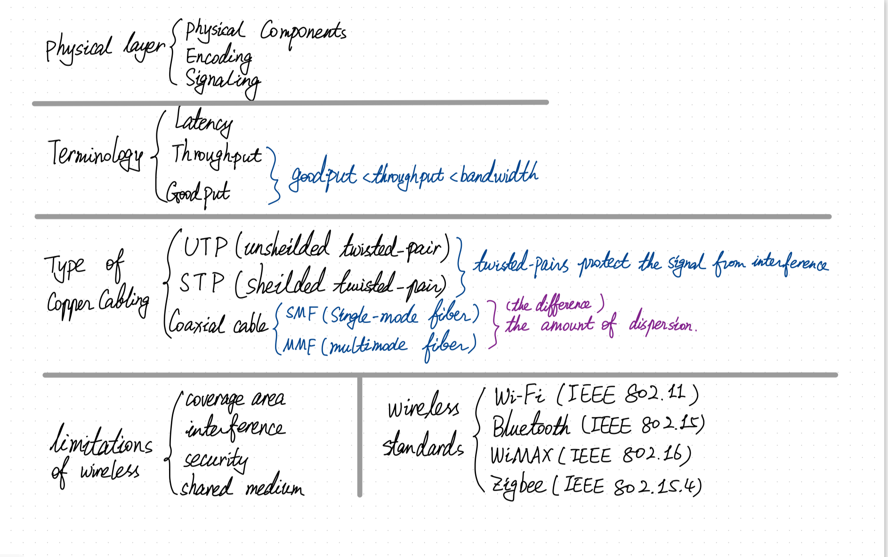
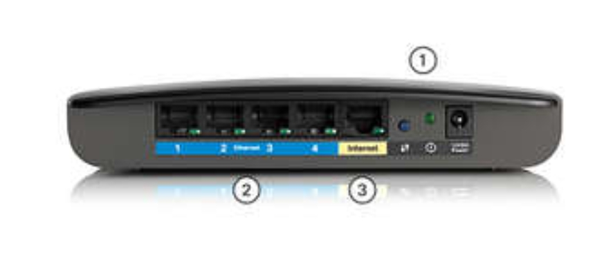
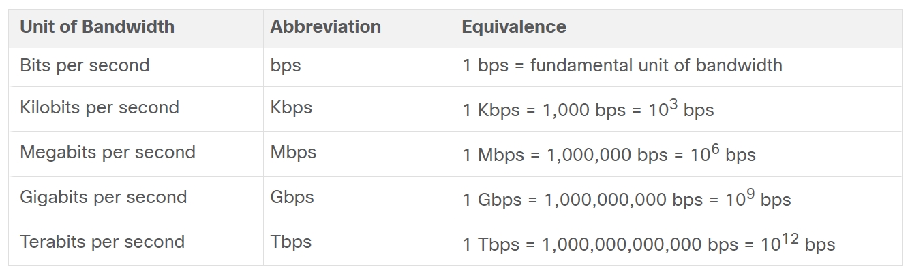
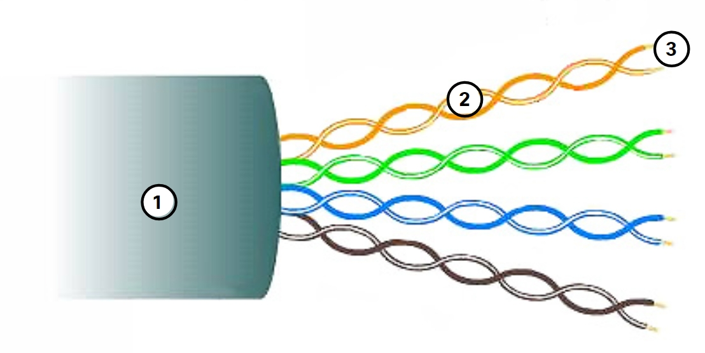
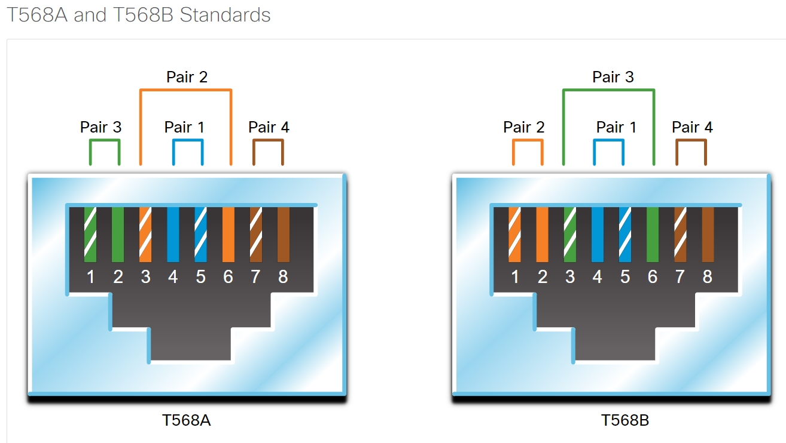
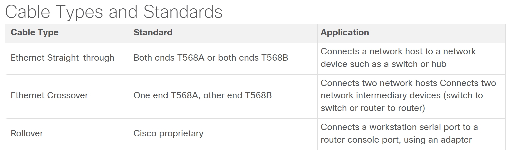
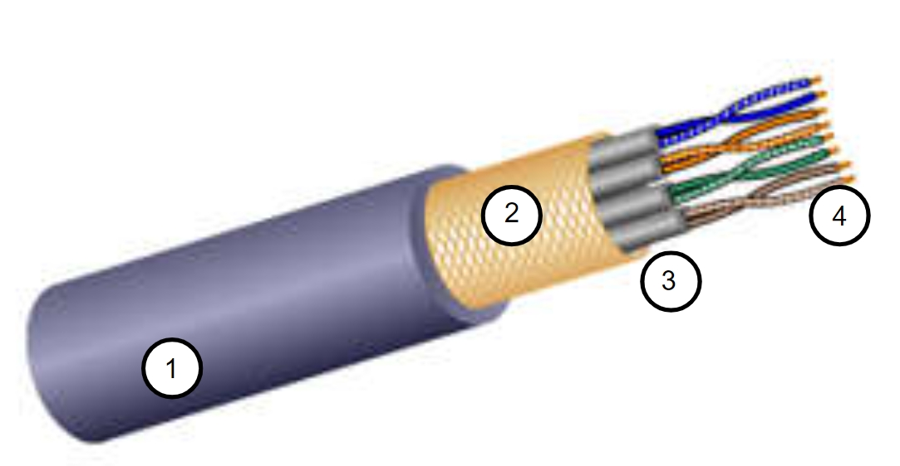
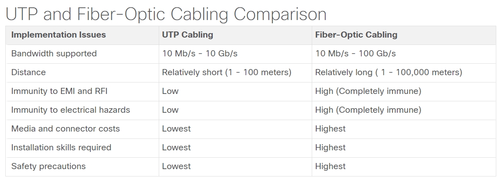

# Physical Layer

## The Physical Connection

Devices on a wireless network must be connected to a wireless access point (AP) or wireless router.

### Wireless Router

>1. The wireless antennas 
>2. Several Ethernet switchports
>3. An internet port

* **Network Interface Cards (NIC)**

Network interface cards (NICs) connect a device to the network. 

>* Ethernet NICs are used for a wired connection.
>* Wireless local area network (WLAN) NICs are used for wireless. 
>* An end-user device may include one or both types of NICs.

### The Physical Layer Characteristics

>* The OSI physical layer provides the means to transport the bits that make up a data link layer frame across the network media.
>* This layer accepts a complete frame from the data link layer and encodes it as a series of signals that are transmitted to the local media. The encoded bits that comprise a frame are received by either an end device or an intermediate device.
>* The *destination node physical layer* **retrieves** these individual signals from the media, **restores** them to their bit representations, and **passes** the bits up to the data link layer as a complete frame.

The physical layer standards address three functional areas:

>* Physical Components
>* Encoding
>* Signaling 

**Physical Components**

> The**physical components** are the electronic hardware devices, media, and other connectors that transmit the signals that represent the bits.

**Encoding**

> Encoding is the method or pattern used to represent digital information. 

**Signaling**

>  **the signaling method**: The physical layer  generate the electrical, optical, or wireless signals that represent the "1" and "0" on the media. 

### Bandwidth

>* Bandwidth is the capacity at which a medium can carry data. (Bandwidth /= the speed that bits travel)

>* Digital bandwidth measures the amount of data that can flow from one place to another in a given amount of time.

>* A combination of factors determines the practical bandwidth of a network:
>1. The properties of the physical media
>2. The technologies chosen for signaling and detecting network signals

* Bandwidth is typically measured in <u>kilobits per second (kbps)</u>, <u>megabits per second (Mbps)</u>, or <u>gigabits per second (Gbps)</u>. 

### Terminology

**Latency**

>* Latency refers to the amount of time, including delays, for data to travel from one given point to another.
>* In an internetwork, or a network with multiple segments, throughput cannot be faster than the slowest link in the path from source to destination. 

**Throughput**

>* Throughput is the measure of the transfer of bits across the media over a given period of time.
>* Throughput < bandwidth.
>*  influence throughput:
>1. The amount of traffic
>2. The type of traffic
>3. The latency created by the number of network devices encountered between source and destination

**Goodput**

>* Goodput is the measure of usable data transferred over a given period of time.
>* Goodput = throughput - traffic overhead (establishing sessions + acknowledgments + encapsulation + retransmitted) / bits. 
>* Goodput < throughput.

## Copper Cabling

* Data is transmitted on copper cables as **electrical pulses**.

    The timing and voltage values of the electrical pulses are also susceptible to interference from two sources:

    * **Electromagnetic interference (EMI)** or **radio frequency interference (RFI)** 
    
        EMI and RFI signals can distort and corrupt the data signals being carried by copper media. Potential sources of EMI and RFI include radio waves and electromagnetic devices.

    * **Crosstalk**
    
        Crosstalk is a disturbance caused by the electric or magnetic fields of a signal on one wire to the signal in an adjacent wire. 

    The susceptibility of copper cables to electronic noise can also be limited using these recommendations:

    * Selecting the cable type or category most suited to a given networking environment.
    * Designing a cable infrastructure to avoid known and potential sources of interference in the building structure.
    * Using cabling techniques that include the proper handling and termination of the cables.

### **Types of Copper Cabling**

>* UTP (Unshielded twisted-pair) 
>* STP (Shielded twisted-pair) 
>* Coaxial cable

<big>**UTP**</big> 

UTP is the most common networking media.
 
In LANs, UTP cable's key features：

1. The outer jacket protects the copper wires from physical damage.
2. **Twisted-pairs** protect the signal from interference.
3. **Color-coded plastic insulation electrically** isolates wires from each other and identifes each pair

<big>**STP**</big>

STP provides better noise protection than UTP cabling but more expensive and difficult to install.

STP cables:

* combine the techniques of shielding to counter EMI and RFI.
* wire twisting to counter crosstalk.
* are terminated with special shielded STP data connectors to gain the full benefit of the shielding ->  If the cable is improperly grounded, the shield may act as an antenna and pick up unwanted signals.

key features of shielded twisted-pair cable:
1. Outer jacket
2. Braided or foil shield
3. Foil shields
4. Twisted pairs

<big>**Coaxial cable**</big>

the coaxial cable design is used in the following situations:

* **Wireless installations**

    Coaxial cables attach antennas to wireless devices. 
    
    The coaxial cable carries radio frequency (RF) energy between the antennas and the radio equipment.

* **Cable internet installations** 

    Cable service providers provide internet connectivity to their customers with **fiber-optic cable**, but the wiring inside the customer's premises is still coax cable.

key features of coaxial cable:
1. Outer jacket
2. Braided copper shielding
3. Plastic insulation
4. Copper conductor

## <big>Fiber-Optic Cabling</big>

fiber-optic cable:

* transmits data over longer distances and at higher bandwidths than any other networking media.

* can transmit signals with **less attenuation** 

* completely **immune to EMI and RFI**

* commonly used to interconnect network devices.

### **Types of Fiber Media**

Fiber-optic cables are broadly classified into two types:

* Single-mode fiber (SMF)
* Multimode fiber (MMF)

    One of the highlighted differences between MMF and SMF is **the amount of dispersion**. 

    * Dispersion refers to the spreading out of a light pulse over time. 

    * Increased dispersion means increased loss of signal strength. <u>MMF has a greater dispersion than SMF</u>.

**Fiber-Optic Cabling Usage**

* **Enterprise Networks** 
    
    Used for backbone cabling applications and interconnecting infrastructure devices

* **Fiber-to-the-Home (FTTH)** 
    
    Used to provide always-on broadband services to homes and small businesses

* **Long-Haul Networks** 
    
    Used by service providers to connect countries and cities

* **Submarine Cable Networks** 
    
    Used to provide reliable high-speed, high-capacity solutions capable of surviving in harsh undersea environments at up to transoceanic distances.

* **Fiber-Optic Connectors**

    * An optical-fiber connector terminates the end of an optical fiber. 

    * The main differences among the types of connectors are dimensions and methods of coupling.

    >* Straight-Tip (ST) Connectors
    >* Subscriber Connector (SC) Connectors
    >* Lucent Connector (LC) Simplex Connectors
    >* Duplex Multimode LC Connectors

    * Until recently, light could only travel in <u>one direction</u> over optical fiber. 
    
    * Two fibers were required to support the full duplex operation.

* **Fiber Patch Cords**

    The use of color distinguishes between single-mode (yellow) and multimode patch cords (orange or aqua).

    >* SC-SC Multimode Patch Cord
    >* LC-LC Single-Mode Patch Cord
    >* ST-LC Multimode Patch Cord
    >* SC-ST Single-Mode Patch Cord

## Wireless Media

Wireless media carry electromagnetic signals that represent the binary digits of data communications using radio or microwave frequencies. 

limitations of wireless:

* **Coverage area** 

    Wireless data communication technologies work well in open environments. However, certain construction materials used in buildings and structures, and the local terrain, will limit the effective coverage.

* **Interference** 

    Wireless is susceptible to interference and can be disrupted by other wireless communications.

* **Security** 

    Wireless communication coverage requires no access to a physical strand of media. Therefore, devices and users, not authorized for access to the network, can gain access to the transmission. Network security is a major component of wireless network administration.

* **Shared medium** 

    WLANs operate in half-duplex, which means only one device can send or receive at a time. The wireless medium is shared amongst all wireless users. Many users accessing the WLAN simultaneously results in reduced bandwidth for each user.

* **Types of Wireless Media**

    physical layer specifications:
    
    * Data to radio signal encoding
    * Frequency and power of transmission   
    * Signal reception and decoding requirements
    * Antenna design and construction

    wireless standards:

    * Wi-Fi (IEEE 802.11) 
    * Bluetooth (IEEE 802.15) 
    * WiMAX (IEEE 802:16)
    * Zigbee (IEEE 802.15.4) 

    Wireless LAN (WLAN) requires a wireless AP and wireless NIC adapters.