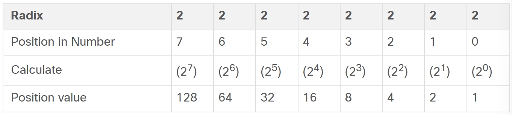
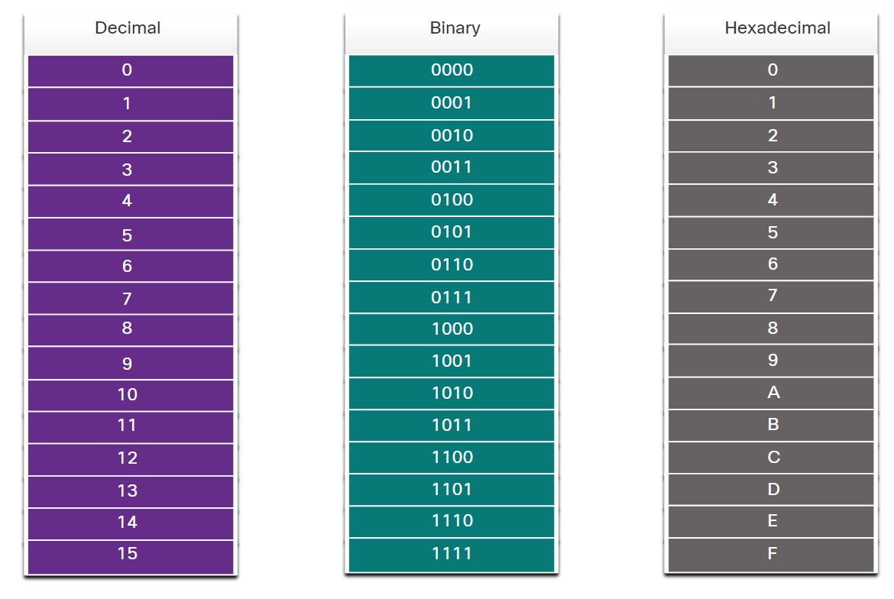
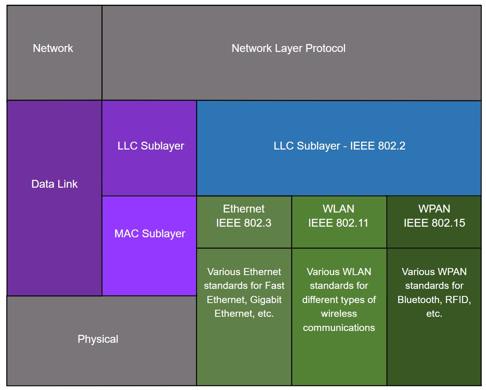
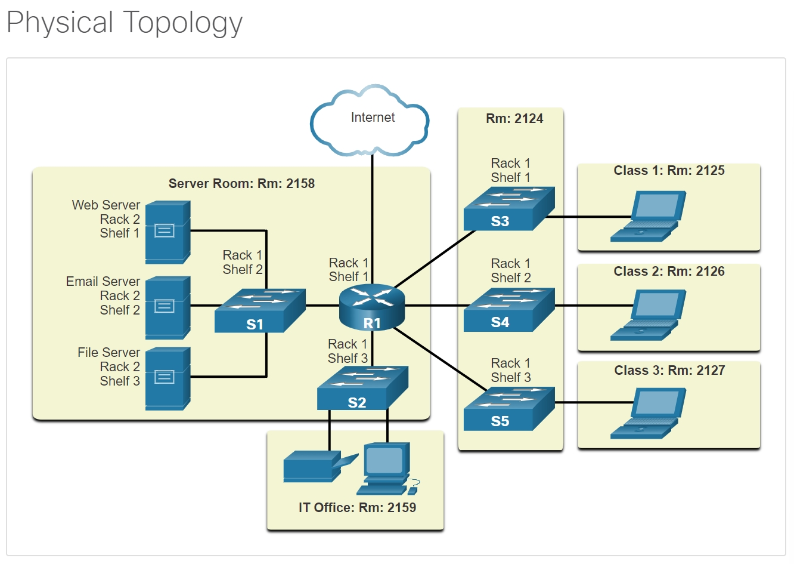
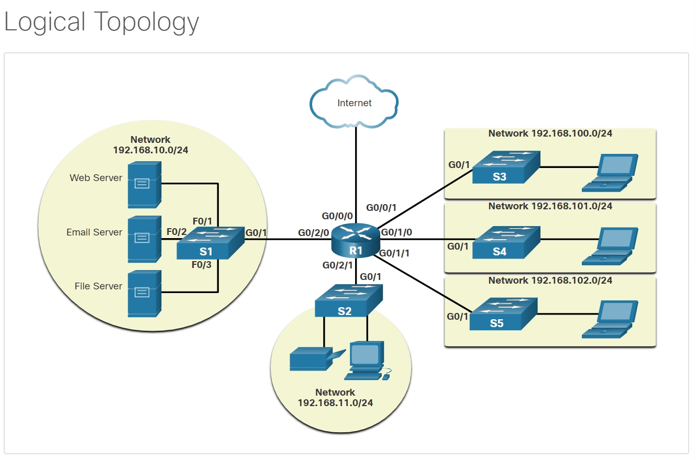

#  Data Link Layer

## Binary and IPv4 Addresses

Hosts, servers, and network devices use binary addressing.

* Each address consists of a string of 32 bits
* Divided into four sections called octets

## Hexadecimal and IPv6 Addresses

The hexadecimal numbering system is used in networking to represent IP Version 6 addresses and Ethernet MAC addresses.

* IPv6 addresses are 128 bits in length and every 4 bits is represented by a single hexadecimal digit; for a total of 32 hexadecimal values. 
* IPv6 addresses are **not case-sensitive**

## The Data Link Layer

The data link layer of the OSI model (Layer 2)：

* prepares network data for the physical network
* responsible for network interface card (NIC) to network interface card communications

The data link layer does the following:

* **Enables upper layers to access the media.** 
    
    The upper layer protocol is completely unaware of the type of media that is used to forward the data.
* Accepts data, usually Layer 3 packets (i.e., IPv4 or IPv6), and encapsulates them into Layer 2 frames.

* Controls how data is placed and received on the media.

* Exchanges frames between endpoints over the network media.

* Receives encapsulated data, usually Layer 3 packets, and directs them to the proper upper-layer protocol.

* Performs error detection and rejects any corrupt frame.

In computer networks, a node is a device that can receive; Without the data link layer, network layer protocols such as IP, would have to make provisions for connecting to every type of media that could exist along a delivery path.

## IEEE 802 LAN/MAN Data Link Sublayers

IEEE 802 LAN/MAN standards are specific to Ethernet LANs, wireless LANs (WLAN), wireless personal area networks (WPAN) and other types of local and metropolitan area networks. 

* **Logical Link Control (LLC)**

>1. This IEEE 802.2 sublayer communicates between the **networking software at the upper layers** and the **device hardware at the lower layers**. 
>2. It places information in the frame that identifies which network layer protocol is being used for the frame. 
>3. This information allows multiple Layer 3 protocols, such as IPv4 and IPv6, to use the same network interface and media.

The LLC sublayer takes the network protocol data, which is typically an IPv4 or IPv6 packet, and adds Layer 2 control information to help deliver the packet to the destination node. 

* **Media Access Control (MAC)**

>1. Implements this sublayer (IEEE 802.3, 802.11, or 802.15) in hardware. 
>2. It is responsible for **data encapsulation** and **media access control**. 
>3. It provides data link layer addressing and it is integrated with various physical layer technologies.

The MAC sublayer controls the NIC and other hardware that is responsible for sending and receiving data on the wired or wireless LAN/MAN medium.

The MAC sublayer provides data encapsulation:

1. **Frame delimiting** 
    
    The framing process provides important delimiters to identify fields within a frame. These delimiting bits provide synchronization between the transmitting and receiving nodes.

2. **Addressing** 
    
    Provides source and destination addressing for transporting the Layer 2 frame between devices on the same shared medium.

3. **Error detection** 
    
    Includes a trailer used to detect transmission errors.

The MAC sublayer also provides media access control, allowing multiple devices to communicate over a shared (half-duplex) medium. Full-duplex communications do not require access control.

## Providing Access to Media

Serial links enable direct connections between two devices, often routers. Router interfaces wrap packets into suitable frames and employ specific media access control methods for each link. During network layer packet exchanges, multiple data link layers and media transitions can occur.

At each hop along the path, a router performs the following Layer 2 functions:

* Accepts a frame from a medium
* De-encapsulates the frame
* Re-encapsulates the packet into a new frame
* Forwards the new frame appropriate to the medium of that segment of the physical network

## Data Link Layer Standards

Engineering organizations that define open standards and protocols that apply to the network access layer (i.e., the OSI physical and data link layers) include the following:

* Institute of Electrical and Electronics Engineers (IEEE)
* International Telecommunication Union (ITU)
* International Organization for Standardization (ISO)
* American National Standards Institute (ANSI)

## Physical and Logical Topologies

The topology of a network is the arrangement, or the relationship, of the network devices and the interconnections between them.

describing LAN and WAN networks:

* Physical topology 

    * Identifies the physical connections and how end devices and intermediary devices (i.e, routers, switches, and wireless access points) are interconnected. 
    * The topology may also include specific device location such as room number and location on the equipment rack. 
    * Physical topologies are usually point-to-point or star.

    

* Logical topology 

    * Refers to the way a network transfers frames from one node to the next.
    * This topology identifies virtual connections using device interfaces and Layer 3 IP addressing schemes.

    

## WAN Topologies

* Point-to-Point
* Hub and Spoke
* Mesh

### **Point-to-Point WAN Topology**

* two nodes do not have to share the media with other hosts
* a node does not have to make any determination about whether an incoming frame is destined for it or another node. 

* A point-to-point connection over Ethernet requires the device to determine if the incoming frame is destined for this node.

## LAN Topologies

* end devices are connected to a central intermediary device
* The star and extended topologies are easy to install, very scalable (easy to add and remove end devices), and easy to troubleshoot. 

**Legacy LAN Topologies**

Early Ethernet and legacy Token Ring LAN technologies included two other types of topologies:

* **Bus** 

>1. All end systems are chained to each other and terminated in some form on each end. 
>2. Infrastructure devices such as switches are not required to interconnect the end devices. 
>3. Legacy Ethernet networks were often bus topologies using coax cables because it was inexpensive and easy to set up.

* **Ring** 
    
>1. End systems are connected to their respective neighbor forming a ring. 
>2. The ring does not need to be terminated, unlike in the bus topology. 
>3. Legacy Fiber Distributed Data Interface (FDDI) and Token Ring networks used ring topologies.

## Half and Full Duplex Communication

It is important that two interconnected interfaces operate using the **same duplex mode** -> Otherwise, there will be a duplex mismatch creating inefficiency and latency on the link.

* **Half-duplex communication**

    * Both devices can transmit and receive on the media 
    * allows **only one** device to send or receive at a time on the shared medium

* **Full-duplex communication**

    * Both devices can simultaneously transmit and receive on the shared media
    * The data link layer assumes that the media is available for transmission for **both nodes at any time**

Today, Ethernet networks operate in full-duplex and do not require an access method.

## Access Control Methods

* Contention-based access
* Controlled access

### **Contention-based access** 
* all nodes are operating in half-duplex
* only one device can send at a time.

Examples of contention-based access methods include the following:

* Carrier sense multiple access with collision detection (CSMA/CD) used on legacy bus-topology Ethernet LANs
* Carrier sense multiple access with collision avoidance (CSMA/CA) used on Wireless LANs

## **Controlled access**
* each node has its own time to use the medium
* These deterministic types of legacy networks are inefficient

Examples of multiaccess networks that use controlled access include the following:

* Legacy Token Ring
* Legacy ARCNET

## Contention-Based Access - CSMA/CD

Examples of contention-based access networks include the following:

* Wireless LAN (uses CSMA/CA)
* Legacy bus-topology Ethernet LAN (uses CSMA/CD)
* Legacy Ethernet LAN using a hub (uses CSMA/CD)

These networks operate in half-duplex mode, if two devices transmit at the same time, a collision will occur. 

## Contention-Based Access - CSMA/CA

* CMSA/CA does not detect collisions but attempts to avoid them by **waiting before transmitting**.

* Each device that transmits includes the time duration that it needs for the transmission. 

* All other wireless devices receive this information and know how long the medium will be unavailable.

Whether it is an Ethernet LAN using hubs, or a WLAN, contention-based systems do not scale well under heavy media use.

Ethernet LANs using switches do not use a contention-based system because the switch and the host NIC operate in full-duplex mode.

## The Frame

The data link layer prepares the encapsulated data (usually an IPv4 or IPv6 packet) for transport across the local media by encapsulating it with a header and a trailer to create a frame.

Each frame type has three basic parts:

* Header
* Data
* Trailer

## Frame Fields

Framing breaks the stream into decipherable groupings, with control information inserted in the header and trailer as values in different fields. 

Frame felds include the following:

* **Frame start and stop indicator flags** 

    Used to identify the beginning and endlimits of the frame.

* **Addressing** 

    Indicates the source and destination nodes on the media.
    
* **Type** 

    Identifes the Layer 3 protocol in the data field.
    
* **Control** 
    
    Identifes special flow control services such as quality of service (QoS)QoS gives forwarding priority to certain types of messages. 
    
* **Data** 

    Contains the frame payload (i.e., packet header, segment header, and thedata).

* **Error Detection** 

    Included after the data to form the trailer.

* Data link layer addresses where data goes locally and adds error checks to frames to detect issues caused by signal problems.

* The address in the frame header points to the local destination, and error checks are added at the end to spot transmission problems.

* Error detection, like using CRC values in the frame check sequence (FCS) field, helps find transmission errors caused by signal interference.

* The FCS in the Ethernet trailer tells if the frame had transmission issues, using a logical summary (CRC value) created by the sending node.

## physical addresses(Layer 2 Addresses)

In TCP/IP networks, OSI Layer 2 protocols team up with OSI Layer 3 IP. The choice of Layer 2 protocol relies on logical topology and physical media. Each protocol manages media access for specific Layer 2 setups, dictated by the technology behind that setup.

## LAN and WAN Frames

WANs traditionally used other types of protocols for various types of point-to-point, hub-spoke, and full-mesh topologies. Some of the common WAN protocols over the years have included:

* Point-to-Point Protocol (PPP)
* High-Level Data Link Control (HDLC)
* Frame Relay
* Asynchronous Transfer Mode (ATM)
* X.25

Data link layer protocols include:

* Ethernet
* 802.11 Wireless
* Point-to-Point Protocol (PPP)
* High-Level Data Link Control (HDLC)
* Frame Relay

