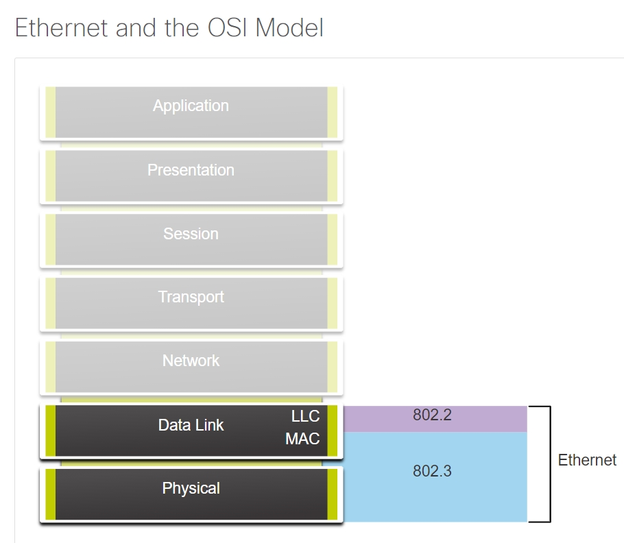
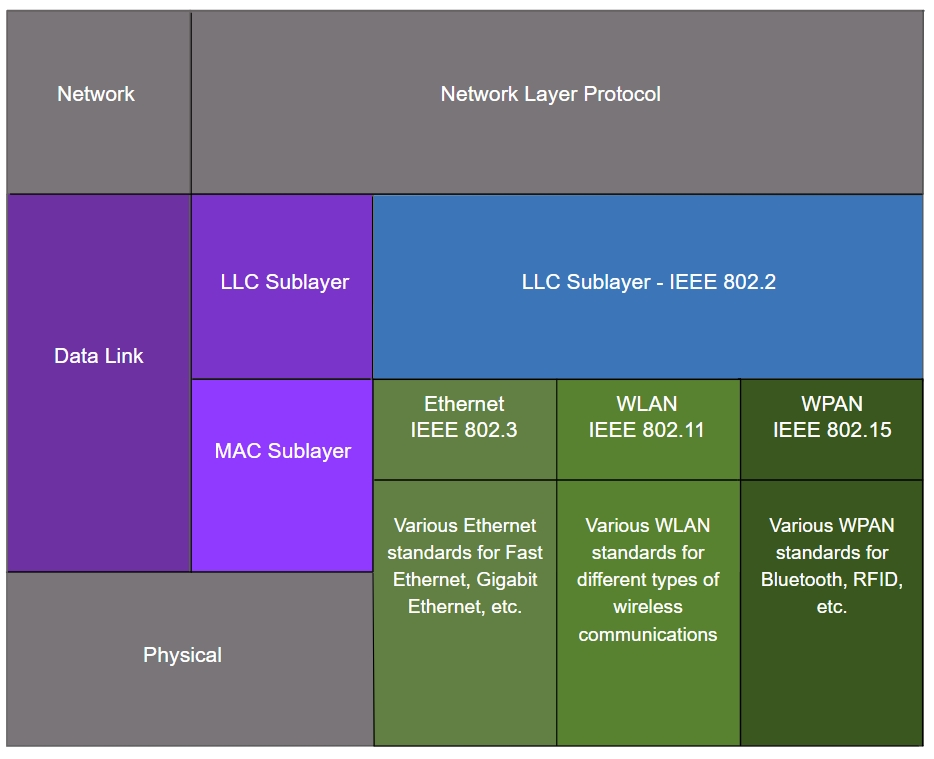
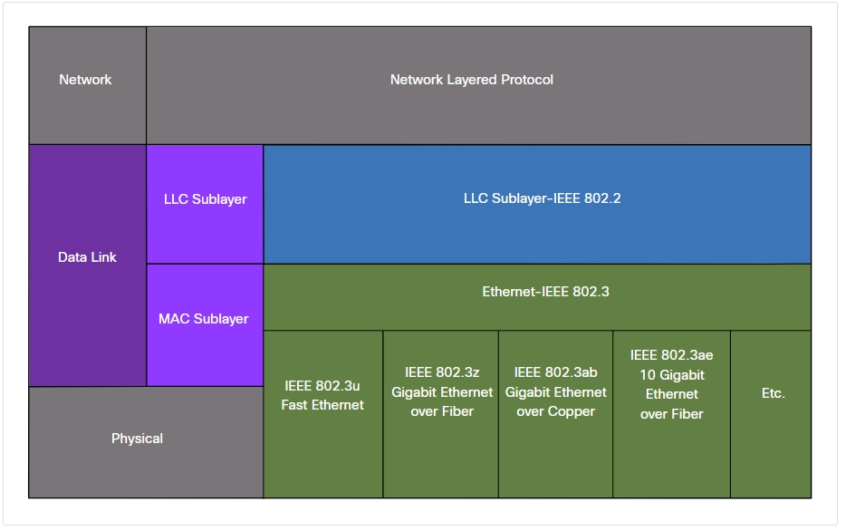
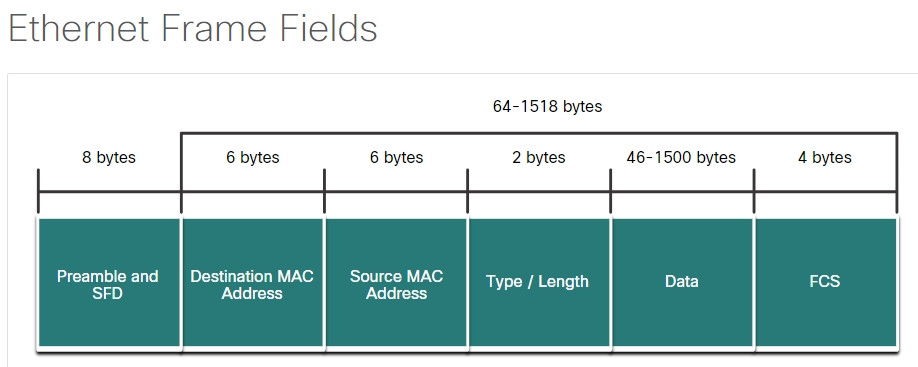
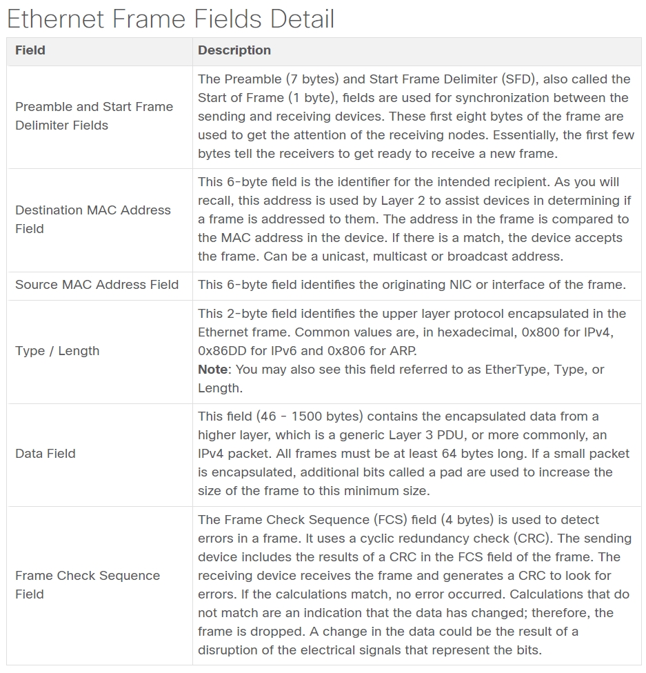
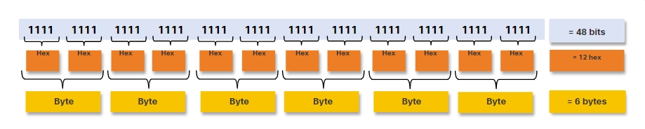
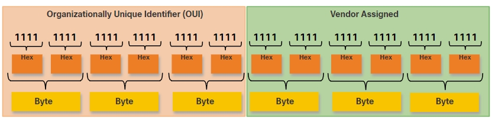

# Ethernet Switching

## **Ethernet Encapsulation**

Ethernet is one of two LAN technologies used today, uses wired communications, including twisted pair, fiber-optic links, and coaxial cables.

* Ethernet operates in the **data link layer** and the **physical layer**.

* It is a family of networking technologies defined in the **IEEE 802.2 and 802.3 standards**.

* Ethernet supports data bandwidths of the following:

    * 10 Mbps
    * 100 Mbps
    * 1000 Mbps (1 Gbps)
    * 10,000 Mbps (10 Gbps)
    * 40,000 Mbps (40 Gbps)
    * 100,000 Mbps (100 Gbps)

    

## **Data Link Sublayers**

IEEE 802 LAN/MAN protocols, including Ethernet, use the LLC and MAC to operate.

* **LLC Sublayer** 

    * This IEEE 802.2 sublayer communicates between the networking software at the upper layers and the device hardware at the lower layers. 

    * It places information in the frame that identifies which network layer protocol is being used for the frame. 

    * This information allows multiple Layer 3 protocols, such as IPv4 and IPv6, to use the same network interface and media.

* **MAC Sublayer** 

    * This sublayer (IEEE 802.3, 802.11, or 802.15 for example) is implemented in hardware and is responsible for data encapsulation and media access control. 
    
    * It **provides data link layer addressing** and is **integrated** with various physical layer technologies.

## **MAC Sublayer**

The MAC sublayer is responsible for **data encapsulation** and **accessing the media**.

### **Data Encapsulation**

IEEE 802.3 data encapsulation includes the following:

* **Ethernet frame** 

    This is **the internal structure** of the Ethernet frame.

* **Ethernet Addressing** 

    The Ethernet frame includes both a **source** and **destination** MAC address to deliver the Ethernet frame from Ethernet NIC to Ethernet NIC on the same LAN.

* **Ethernet Error detection** 

    The Ethernet frame includes a **frame check sequence (FCS)** trailer used for **error detection**.

### Accessing the Media

## Ethernet Frame Fields

* The Ethernet frame size is **[64, 1518]**

* includes all bytes from the **destination MAC address** field through the **frame check sequence (FCS)** field.

* The preamble field is not included when describing the size of the frame.

* Frames [0,64) is considered a "collision fragment" or "runt frame" and is automatically discarded by receiving stations.

* Frames (1500, ) bytes of data are considered "jumbo" or "baby giant frames", the receiving device drops the frame.

*  Jumbo frames are usually supported by most Fast Ethernet and Gigabit Ethernet switches and NICs.

## Ethernet MAC Address

* In an Ethernet LAN, every network device is connected to the same, shared media. 

* The MAC address is used to identify the physical source and destination devices (NICs) on the local network segment.

* All MAC addresses must be **unique** to the Ethernet device or Ethernet interface.

When a vendor assigns a MAC address to a device or Ethernet interface, the vendor must do as follows:

* Use its assigned OUI as the first 6 hexadecimal digits.
* Assign a unique value in the last 6 hexadecimal digits.

## Frame Processing

When the computer boots up, the NIC copies its MAC address from ROM into RAM. 

When a device is forwarding a message to an Ethernet network, the Ethernet header includes these:

* **Source MAC address** of the source device NIC.

* **Destination MAC address** of the destination device NIC.

> -> NIC receives an Ethernet frame 

> -> examines the destination MAC address -> if it matches the physical MAC address that is stored in RAM. 
 
> ->If there is no match, the device discards the frame. 

> -> If there is a match, it passes the frame up the OSI layers, where the de-encapsulation process takes place.

**Note**: Ethernet NICs will also accept frames if the destination MAC address is a broadcast or a multicast group of which the host is a member.

## Unicast MAC Address

* In Ethernet, different MAC addresses are used for Layer 2 unicast, broadcast, and multicast communications.

* A unicast MAC address is the **unique address** that is used when a frame is sent from a single transmitting device to a single destination device.

* The source MAC address must always be a unicast.

## Broadcast MAC Address

* An Ethernet broadcast frame is received and processed by every device on the Ethernet LAN. 

The features of an Ethernet broadcast are as follows:

>* It has a destination MAC address of FF-FF-FF-FF-FF-FF in hexadecimal (48 ones in binary).
>* It is flooded out all Ethernet switch ports except the incoming port.
>* It is not forwarded by a router.

If the encapsulated data is an IPv4 broadcast packet, this means the packet contains a destination IPv4 address that has all ones (1s) in the host portion.

**Not all Ethernet broadcasts carry an IPv4 broadcast packet** 

>* Ethernet broadcasts with IPv4 packets use a destination MAC address of FF-FF-FF-FF-FF-FF.
>* DHCP for IPv4 employs Ethernet and IPv4 broadcast addresses.
>* Ethernet multicast frames have specific destination MAC addresses (01-00-5E for IPv4 multicast, 33-33 for IPv6 multicast).
>* Reserved multicast MAC addresses exist for non-IP data (e.g., Spanning Tree Protocol, LLDP).
>* By default, Ethernet multicast frames are sent to all switch ports except the incoming port, unless multicast snooping is configured.
>* Routers do not forward Ethernet multicast frames unless specifically set up to route multicast packets.
>* Devices in an IP multicast group are assigned a multicast group IP address, needing a corresponding multicast MAC address for local network delivery.

## The MAC Address Table

The MAC address table is sometimes referred to as a content addressable memory (CAM) table.

### Switch Learning and Forwarding

* The switch dynamically **builds the MAC address table** by examining the source MAC address of the frames received on a port.  

**Examine the Source MAC Address**

It does this by examining the source MAC address of the frame and the port number where the frame entered the switch.

>1. New source MAC addresses are added to the table with the incoming port. 
>2. Existing MAC addresses update their refresh timer when encountered.
>3. Ethernet switches typically maintain entries in the table for 5 minutes.

* **Note**: If a known MAC address is detected on a different port, it's treated as a new entry and replaces the older one with the updated port.

* The switch **forwards frames** by searching for a match between the destination MAC address in the frame and an entry in the MAC address table.

**Find the Destination MAC Address**

>1. For a unicast destination MAC, the switch checks its MAC address table.
>2. If the MAC address is in the table, the frame is sent out through the specified port.
> 3. If the MAC address isn't in the table, the switch forwards the frame to all ports except the incoming port (unknown unicast).
* **Note**: Broadcast and multicast frames are also flooded to all ports except the incoming port.

## Filtering Frames

When the MAC address table of the switch contains the destination MAC address, it is able to filter the frame and forward out a single port.

* **PC-D to Switch**

* **Switch to PC-A**

* **PC-A to Switch to PC-D**

## Frame Forwarding Methods on Cisco Switches

Cisco switches employ two frame forwarding methods:

* **Store-and-forward**

    Receives the entire frame, performs CRC to detect errors, looks up the destination address, and forwards the frame through the correct port.

* **Cut-through**

    Forwards the frame as soon as the destination address is read, even before the entire frame is received.

Store-and-forward is advantageous as it checks for errors before forwarding, discarding frames with errors to conserve bandwidth. It's crucial for QoS analysis in converged networks, prioritizing traffic like VoIP over web browsing.

## Cut-Through Switching

>* Cut-through switching starts processing data upon reception, not waiting for the entire frame.
>* It buffers enough of the frame to read the destination MAC address, typically in the first 6 bytes following the preamble.
>* Using its switching table, the switch identifies the outgoing interface port based on the destination MAC address.
>* The frame is forwarded to its destination through the designated port without performing error checking.

There are two variants of cut-through switching:

**Fast-forward switching**

>* Low latency method that forwards packets immediately upon reading the destination address.
>* May relay packets with errors occasionally as forwarding starts before the entire packet is received.
>* Latency measured from the first bit received to the first bit transmitted.
>* Common cut-through method for switching.

**Fragment-free switching**

>* Stores the initial 64 bytes of a frame before forwarding.
>* Acts as a compromise between store-and-forward and fast-forward switching.
>* Aims to enhance fast-forward switching by checking the first 64 bytes for errors (commonly where network errors and collisions occur).
>* Balances between store-and-forward's high integrity (but high latency) and fast-forward's low latency (but reduced integrity).

**Dynamic switching mode**

Some switches switch modes (cut-through to store-and-forward) based on a per-port error threshold.
Automatically switches to store-and-forward when errors surpass the threshold, reverting to cut-through when error rates drop below the threshold.

## Memory Buffering on Switches

**Port-based memory**
>* Frames are organized in queues tied to individual incoming and outgoing ports.
>* Transmission to the outgoing port happens only after preceding frames in the queue are successfully transmitted.
>* A single frame, if occupying the queue for a busy destination port, can delay the transmission of all other frames in memory.
>* This delay persists even if other frames could be sent to available destination ports, causing a queue holdup.

**Shared memory**

>* Frames are stored in a shared memory buffer accessed by all switch ports.
>* Buffer memory allocation for each port is dynamic, adjusting as needed.
>* Frames in the buffer are linked to their destination ports dynamically.
>* This setup allows a packet received on one port to be transmitted from another without relocating to a different queue, facilitating efficient forwarding.

Shared memory buffering also results in the ability to store larger frames with potentially fewer dropped frames. This is important with asymmetric switching which allows for different data rates on different ports.

## Duplex and Speed Settings

There are two types of duplex settings used for communications on an Ethernet network:

**Full-duplex**

Both ends of the connection can send and receive simultaneously.

**Half-duplex**

Only one end of the connection can send at a time.

Autonegotiation, common in Ethernet switches and NICs, automatically negotiates optimal speed and duplex settings between devices. If both devices support it, and their highest common bandwidth aligns, they'll choose full-duplex mode.

**Note**: Most Cisco switches and Ethernet NICs default to autonegotiation for speed and duplex. Gigabit Ethernet ports only operate in full-duplex.

**Duplex Mismatch Issues**:

>* Common cause of performance problems on 10/100 Mbps Ethernet links.
>* Occurs when one port operates at half-duplex while the other runs at full-duplex.
>* Arises during link reset when autonegotiation fails to synchronize settings.
>* Can also happen when one side is reconfigured without updating the other.

**Autonegotiation Considerations**:

>* Both link partners should either enable or disable autonegotiation.
>* Best practice: Configure both switch ports as full-duplex for optimal performance.

Duplex mismatch leads to performance degradation due to conflicting duplex settings between connected ports, commonly occurring during resets or misconfigurations, emphasizing the importance of aligning settings between link partners for smooth operation.

## Auto-MDIX
**Auto-MDIX Feature**

>* Most modern switches support auto-MDIX.
>* Auto-MDIX enables automatic detection and configuration of cable types on ports.
>* Allows usage of either crossover or straight-through cables for copper 10/100/1000 ports regardless of connected device.

The evolution of technology has minimized cable concerns through the auto-MDIX feature, allowing flexibility in cable choices, but it's advisable to use the correct cable type and not solely depend on auto-MDIX, especially if it's disabled or unsupported.

