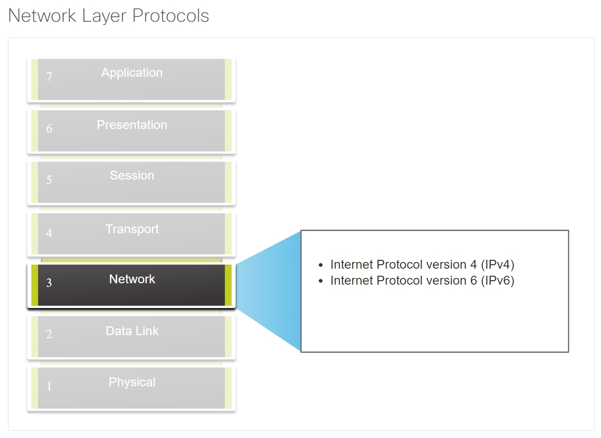
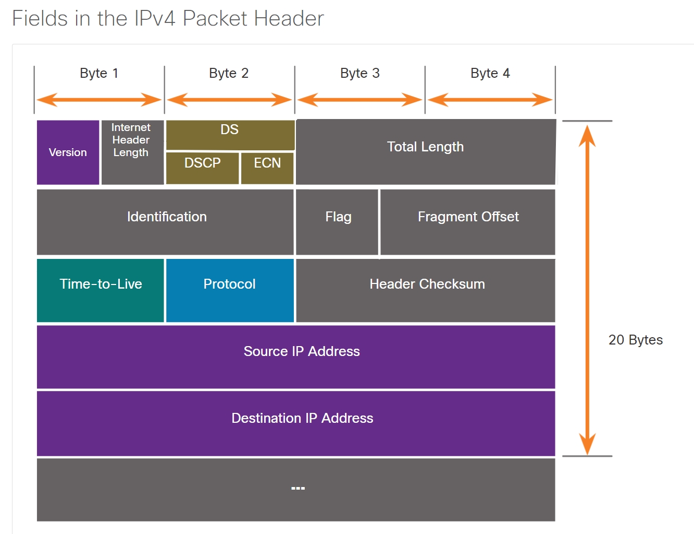
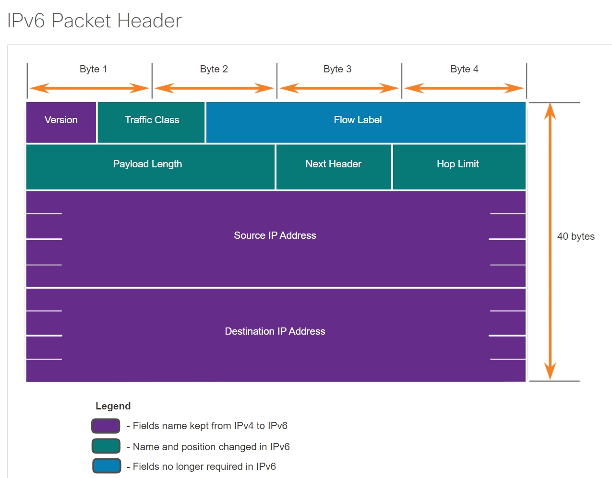

# Network Layer

## The Network Layer (OSI Layer 3)

It provides services to allow end devices to exchange data across networks.



network layer protocols perform four basic operations:

* **Addressing end devices** 

    End devices must be configured with a unique IP address for identification on the network.

* **Encapsulation** 

    * The network layer encapsulates the protocol data unit (PDU) from the transport layer into a packet. 
    * The encapsulation process adds IP header information, such as the IP address of the source (sending) and destination (receiving) hosts. 
    * The encapsulation process is performed by the source of the IP packet.

* **Routing** 

    * The network layer provides services to direct the packets to a destination host on another network. 
    * To travel to other networks, the packet must be processed by a router. 
    * The role of the router is to select the best path and direct packets toward the destination host in a process known as routing. 
    * A packet may cross many routers before reaching the destination host. Each router a packet crosses to reach the destination host is called a hop.

* **De-encapsulation** 

    * When the packet arrives at the network layer of the destination host, the host checks the IP header of the packet. 
    * If the destination IP address within the header matches its own IP address, the IP header is removed from the packet. 
    * After the packet is de-encapsulated by the network layer, the resulting Layer 4 PDU is passed up to the appropriate service at the transport layer. 
    * The de-encapsulation process is performed by the destination host of the IP packet.

## IP Encapsulation

* IP encapsulates the transport layer (the layer just above the network layer) segment or other data by adding an IP header. 

* The IP header is used to deliver the packet to the destination host.

* The process of encapsulating data layer by layer enables the services at the different layers to develop and scale without affecting the other layers.

## Characteristics of IP

basic characteristics of IP:

* **Connectionless** 

    * There is no connection with the destination established before sending data packets.

    * IP is connectionless, meaning that no dedicated end-to-end connection is created by IP before data is sent.

* **Best Effort** 

IP is inherently unreliable because packet delivery is not guaranteed.

* **Media Independent** 

Operation is independent of the medium carrying the data.

## IPv4 Packet Header

An IPv4 packet header consists of fields containing important information about the packet, is used to ensure that this packet is delivered to its next stop on the way to its destination end device.

These fields contain binary numbers which are examined by the Layer 3 process.

### IPv4 Packet Header Fields


Significant fields in the IPv4 packet header include: version, DS, header checksum, TTL, protocol, and the source and destination IPv4 addresses.

### three major issues of IPv4:

* **IPv4 address depletion**

    IPv4 has a limited number of unique public addresses available. 

* **Lack of end-to-end connectivity** 

    Because the public IPv4 address is shared, the IPv4 address of an internal network host is hidden. This can be problematic for technologies that require end-to-end connectivity.

* **Increased network complexity** 

    While NAT has extended the lifespan of IPv4, NAT in its various implementation creates additional complexity in the network, creating latency and making troubleshooting more difficult.


### IPv6 

Improvements that IPv6 provides:

* **Increased address space** 

    IPv6 addresses are based on 128-bit hierarchical addressing.

* **Improved packet handling** 

    The IPv6 header has been simplified with fewer fields.

* **Eliminates the need for NAT** 

### IPv6 Packet Header


The fields in the IPv6 packet header include: version, traffic class, flow label, payload length, next header, hop limit, and the source and destination IPv6 addresses.

## Host Forwarding Decision

A host can send a packet to the following:

* **Itself**

    A host can ping itself by sending a packet to a special **IPv4 address of 127.0.0.1** or an **IPv6 address ::1**, which is referred to as the loopback interface. Pinging the loopback interface tests the TCP/IP protocol stack on the host.

* **Local host** 

    This is a destination host that is on the same local network as the sending host. The source and destination hosts share the same network address.

* **Remote host** 

    This is a destination host on a remote network. The source and destination hosts do not share the same network address.

Whether a packet is destined for a local host or a remote host is determined by the source end device. The source end device determines whether the destination IP address is on the same network that the source device itself is on. The method of determination varies by IP version:

* In IPv4 - The source device uses its own subnet mask along with its own IPv4 address and the destination IPv4 address to make this determination.
* In IPv6 - The local router advertises the local network address (prefix) to all devices on the network.

## Default Gateway

On a network, a default gateway is usually a router with these features:

* It has a local IP address in the same address range as other hosts on the local network.
* It can accept data into the local network and forward data out of the local network.
* It routes traffic to other networks.

A default gateway is required to send traffic outside of the local network. Traffic cannot be forwarded outside the local network if there is no default gateway, the default gateway address is not configured, or the default gateway is down.

## A Host Routes to the Default Gateway

A host routing table will typically include a default gateway. 

* In IPv4, the host receives the IPv4 address of the default gateway either dynamically from Dynamic Host Configuration Protocol (DHCP) or configured manually. 

* In IPv6, the router advertises the default gateway address or the host can be configured manually.

Having a default gateway configured creates a default route in the routing table of the PC. A default route is the route or pathway your computer will take when it tries to contact a remote network.

## Host Routing Tables
On a Windows host, 
```
route print
netstat -r
```
command can be used to display the host routing table, displays three sections related to the current TCP/IP network connections:

* **Interface List** - Lists the Media Access Control (MAC) address and assigned interface number of every network-capable interface on the host, including Ethernet, Wi-Fi, and Bluetooth adapters.
* **IPv4 Route Table** - Lists all known IPv4 routes, including direct connections, local network, and local default routes.
* **IPv6 Route Table** - Lists all known IPv6 routes, including direct connections, local network, and local default routes.

### IPv4 Routing Table

```
show ip route
```
privileged EXEC mode command is used to view the IPv4 routing table on a Cisco IOS router. 

Common route sources (codes) include these:

* **L** - Directly connected local interface IP address
* **C** – Directly connected network
* **S** – Static route was manually configured by an administrator
* **O** - Open Shortest Path First (OSPF)
* **D** - Enhanced Interior Gateway Routing Protocol (EIGRP)

## IP Router Routing Table

The routing table stores three types of route entries:

* **Directly-connected networks** 

   * These network route entries are active router interfaces. Routers add a directly connected route when an interface is configured with an IP address and is activated. 
    
    * Each router interface is connected to a different network segment. 

* **Remote networks** 

    These network route entries are connected to other routers. Routers learn about remote networks either by being explicitly configured by an administrator or by exchanging route information using a dynamic routing protocol. 

* **Default route** 

    Like a host, most routers also include a default route entry, a gateway of last resort. The default route is used when there is no better (longer) match in the IP routing table. 

A router can learn about remote networks in one of two ways:

* **Manually**

    Remote networks are manually entered into the route table using static routes.

* **Dynamically** 

    Remote routes are automatically learned using a dynamic routing protocol.

## Static Routing

* Static routes are route entries that are manually configured. 

* If there is a change in the network topology, the static route is not automatically updated and must be manually reconfigured.

Static routing has the following characteristics:

* A static route must be configured manually.
* The administrator needs to reconfigure a static route if there is a change in the topology and the static route is no longer viable.
* A static route is appropriate for a small network and when there are few or no redundant links.

## Dynamic Routing

* A dynamic routing protocol allows the routers to automatically learn about remote networks, including a default route, from other routers. 

* Routers that use dynamic routing protocols automatically share routing information with other routers and compensate for any topology changes without involving the network administrator. 

* If there is a change in the network topology, routers share this information using the dynamic routing protocol and automatically update their routing tables.

* Dynamic routing protocols include OSPF and Enhanced Interior Gateway Routing Protocol (EIGRP). 

The dynamic routing protocol will automatically do as follows:

* Discover remote networks
* Maintain up-to-date routing information
* Choose the best path to destination networks
* Attempt to find a new best path if the current path is no longer available

When a router is manually configured with a static route or learns about a remote network dynamically using a dynamic routing protocol, the remote network address and next hop address are entered into the IP routing table.


